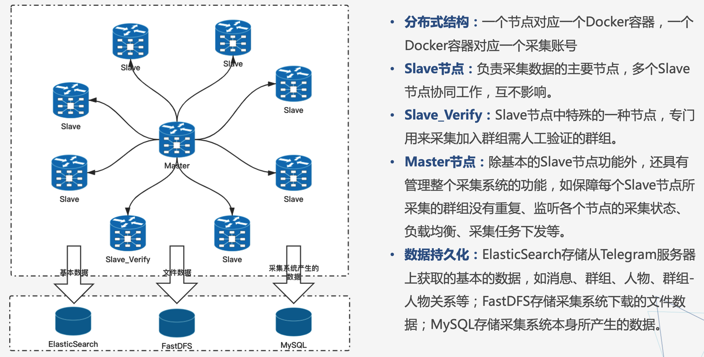
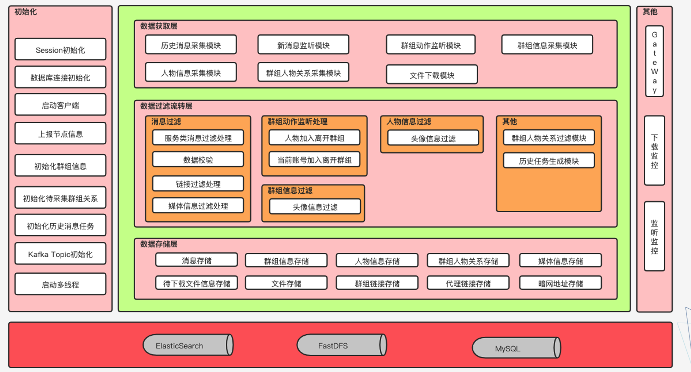
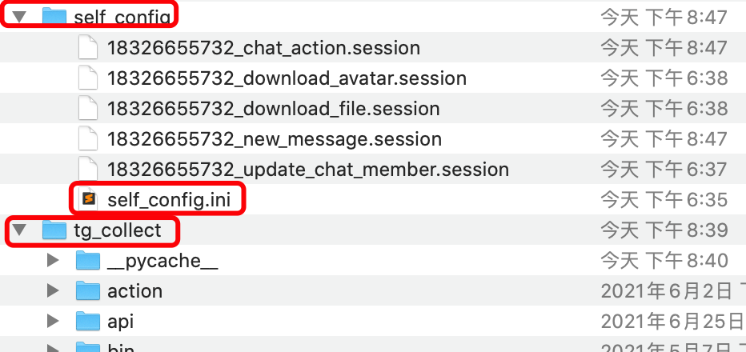
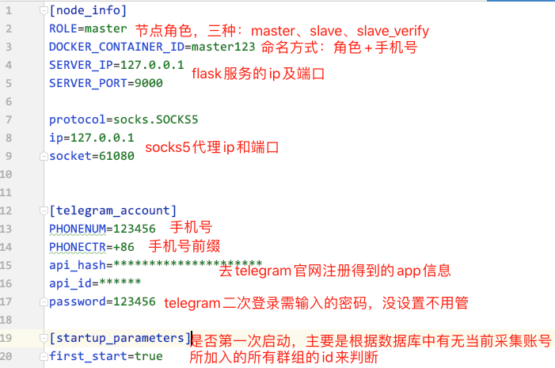
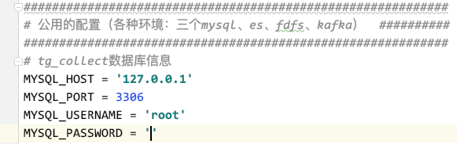
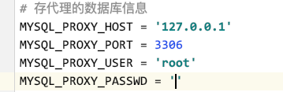
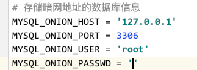
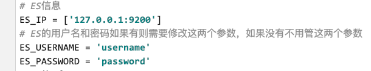
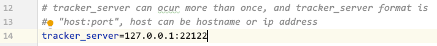

# 一、系统介绍

## 1. 简介

本系统是针对Telegram即时通信软件的分布式数据采集系统，采集数据包括消息、群组信息、用户（人物）信息、群组人物关系、媒体文件五大类，采集接口使用[pyrogram](https://https://pyrogram.mendel.sh/topics/tgcrypto.html)。

消息的采集分为实时消息采集和历史消息采集，实时消息采集是通过pyrogram的监听函数监听消息，是一种服务器主动推消息的方式；历史消息采集是通过生成历史消息采集任务，存储到mysql，由单独的线程处理采集任务，是一种主动从Telegram服务器拉取消息的方式。由于一些大的群组或频道有时监听不到消息，所以除系统启动时生成一次历史消息采集任务之外，每隔一定时间也会生成历史消息采集任务，将未监听到的消息作为历史消息来采集。历史消息任务即一条记录，其中包含群组id、该群组采集到的最新消息id（从es查询）、群组最新消息id（通过接口获取）、采集到的消息id（从最高消息id向下采集，记录采集过程）等信息。

群组信息的采集发生在以下几种情况：1、 系统启动时获取群组信息，如第一次启动，则一次获取所有群组信息，不是第一次启动，则通过第一次启动时获取的存储在数据库中的群组id重新获取群组信息。这样做的原因是api限制，调用iter_dialogs()函数次数多了，账号会被处理，所以使用系统时要注意配置文件中的first_start参数；2、当群组信息变化时由监听函数监听到群组动作，重新采集群组信息并覆盖；3、当当前采集账号加入一个群组时（可由监听函数监听），一次获取群组信息。

人物信息采集：由于人物很多，调用获取人物信息的api接口有限制，故通过其他返回数据中的人物信息来提取。1、监听或获取到消息时，消息实体中含有用户信息；2、获取群组人物关系时，数据中包含人物信息。注意，由于没法监听人物信息变化，所以当人物的用户名发生变化时，在es中会存储两份人物数据，用户名不同，以此作为人物的历史username变化。

群组人物关系：1、系统启动时，会一次获取所有群组的所有成员关系，更新成员关系表，这个过程是由单独的线程长时间处理，如果重启频繁，可能比较耗时，非阻塞；2、人物加入群组时，会单独获取该群组和该人物的关系，只一条；3、人物离开群组时，会获取该群组和该人物的关系，当群组成员过多时监听不到人物的离开；4、消息过滤时会校验群组和消息发送者的群组关系，更新关系。

媒体文件：媒体文件的下载分为两类：群组、人物头像的下载和消息文件的下载。群组、人物数据过滤过程中，会判断头像是否已下载，如果没有下载，则通过kafka发送至头像下载模块进行下载。消息文件的下载是通过消息过滤，判断是否还有媒体信息、是否值得下载、是否已下载，然后将需要下载的文件信息存储到es中，由单独的线程进行下载（当前处理方式是通过单独的进程来处理）

整体处理方式大概是这样，时间久远，有其他值得注意的细节后面补充。

## 2. 系统架构

### 1. 整体架构

一主多从结构。

使用分布式原因：

- 单个采集账号所加入群组个数有限制，大概三四百
- master节点可控制整体结构，避免一个群组在多个采集账号中采集的情况，可做多节点的负载均衡
- 防止telegram对ip的监测
- 一个采集账号加入群组过多，如果消息或需要下载的文件过多，下游线程的处理压力较大



### 2. 节点内部结构



#### 1. 初始化

**session初始化**

需要先获取session，可通过task/create_all_need_session.py来创建所需的session，暂时是由多个session，有的单独处理任务的session可以并到new_message_session中去，比如更新群组-人物关系的session，后面可优化

**上报节点信息**

方便master同一管理

**初始化群组信息**

包括采集当前账号所加入的所有的群组信息，如果是第一次启动，通过调用iter_dialogs()函数来获取，否则通过读取数据库当前采集账号的所有群组id，遍历获取。**注意及时修改first_start参数**。

**初始化历史消息任务**

为避免历史消息漏采，启动时需生成历史消息采集任务，后面由历史消息采集线程单独来处理

**kafka topic初始化**

由于一个节点需要的topic过多，不可能在部署前手动去创建这么多topic，所以需提前配置kafka为允许自动创建topic，通过向topic插入数据来创建topic。**注意每个topic消费者需要有处理这种测试数据的代码。**

**启动多线程**

具体的采集处理过程是由多个线程，多个topic共同完成的，前面的步骤执行完，才正式启动多线程进行后续的持续处理。

#### 2. 运行时

这块代码不好描述，大致分为下面几块，需要自己看

**数据获取**

Telegram主动推送或我们主动拉取数据

**数据流转**

包括各种数据的过滤校验处理等。

**数据存储**

处理完的数据通过kafka由存储模块进行存储。

#### 3. 其他

**gateway**

通过flask轻量级web框架，提供restapi来达到控制节点的目的，暂时的设想，待实现

**下载监控**

下载头像和文件的进程容易停掉（两个进程），可能是api的原因，需要定时查看下载进程是否停止。当前能定时获取下载进程是否停止，但是重启的控制代码貌似不太起作用。

**监听监控**

有的大的群组和频道监听不到消息，类似上面也需要定时任务监听。不过现在的处理方式是通过定时生成历史消息采集任务来实现消息的不漏采，没必要进行监听监控了。

**加入群组**

将群组链接写入task/link.txt，运行join_chat_by_file.py文件来讲link.txt里的群组加入采集系统，注意时间停顿，短时间内不可加入过多群组。加入群组的大致过程是先将群组链接发送至管理加入模块，由master做负载均衡处理，如果master所加入群组数小于master所允许加入的最大数（现在设定的是50，可在配置文件中修改），则由master加入该群组，否则master节点做运算，得到哪个节点当前的采集压力最小，将该链接发送至相应节点的topic中，由那个节点来加入链接。

节点的加入群组的topic消费者接收到链接后，会加入该群组，同时初始化群组信息，生成群组历史消息任务，初始化群组成员关系，频道没有成员关系。

**离开群组**

可通过群组id来将群组退出采集系统，如果下次再次加入时，master将此群组再次发送至上次采集该群组的节点账号进行采集。但是我们一般不会将群组退出采集系统。

## 3. 代码结构说明


# 二、运行、部署

## 1. 说明

### 1. 环境

**本地运行所需环境**

1. tg账号，需注册得到api_id和api_hash，注册[链接](https://my.telegram.org/apps)

2. MySQL，版本8.0.19 （8以上）
3. ElasticSearch 版本7.9 （7以上）  （配套kibana）
4. kafka
5. 稳定的socks5代理

**部署时需要的额外环境：**

1. fsdf，本地运行时可以不上传fdfs，将文件存储在本地，需将相应的上传文件的代码注释掉
2. Docker环境，多节点部署在docker容器中
3. git环境

### 2. 配置文件

复制configuration.py.example到同级目录下，改名为configuration.py，将相关配置修改，主要是三个mysql、es、kafka。如果是要部署，需要将deploy目录下的client.conf复制到task目录下，并修改相关配置（这个在后面部署多节点有）。如果是本地运行，需要在项目同级目录下创建目录self_config，并将deploy下的self_config.ini复制到self_config目录下，或者直接修改配置文件configuration.py中当前节点的配置，不从外部配置文件读取配置信息。

## 2. 本地运行（单节点）

### 1. self_config

1. 拉取项目后在tg_collect同级目录下创建目录self_config，并把tg_collect/deploy/self_config.ini拷贝到self_config目录下

   

2. 修改self_config.ini配置文件

   

### 2. 修改配置文件

#### 1. 基本配置文件，多个节点要共用一套环境（mysql、es、kafka）

- 复制collect/configuration.py.example到同级目录，并改名为configuration.py，多个节点用相同的configuration.py配置文件

- 修改tg_collect基本库信息



- 修改存储代理的库信息



- 修改存储暗网地址的库信息



- 修改es信息



- 修改kafka信息


#### 2. fdfs配置文件（本地运行无需上传下载的文件，需在下载模块中注释掉相关代码）



### 3. 启动多个依赖的中间件

数据库、es、kibana、zookeeper、kafka

### 4. 创建数据库

- 创建es索引

  在kibana中直接依次执行第四大部分的es mapping

- 创建名为tg_collect的数据库

  不用建表

- 创建名为mtproxy的数据库

  不用建表

- 创建名为awbackmonitor的数据库

  不用建表

- 创建kafka的topic

  进入到tg_collect/task目录下，运行create_kafka_topic.py文件，<font color=red>需提前设置kafka允许自动创建topic</font>

### 5. 启动程序

1. supervisor.py，主要的采集程序
2. task/download_avatar.py  下载人物和群组的头像
3. task/download_file.py  下载消息中的文件

### 6. 查看日志

在pyCharm中运行可以直接看控制台日志

日志另存在与tg_collect同级目录下的tg_out/log目录，tg_out/tg_download是下载的文件在本地暂存的位置


## 3. 部署（多节点）


# 三、中心代理采集部署


# 四、依赖

## 1. es mapping

索引分片数根据es配置相应改变，一般默认5个分片就行

```json
DELETE user
PUT user
{
  "settings": {
    "number_of_shards": 5,
    "number_of_replicas" : 1,
    "refresh_interval" : "1s"
  },
  "mappings": {
    "properties": {
      "user_id": {
        "type": "long"
      },
      "is_deleted": {
        "type": "boolean"
      },
      "is_bot": {
        "type": "boolean"
      },
      "is_verified": {
        "type": "boolean"
      },
      "is_restricted": {
        "type": "boolean"
      },
      "is_scam": {
        "type": "boolean"
      },
      "is_support": {
        "type": "boolean"
      },
      "first_name": {
        "type": "text",
        "fields": {
          "keyword": {
            "type": "keyword",
            "ignore_above": 256
          }
        }
      },
      "last_name": {
        "type": "text",
        "fields": {
          "keyword": {
            "type": "keyword",
            "ignore_above": 256
          }
        }
      },
      "status": {
        "type": "text",
        "fields": {
          "keyword": {
            "type": "keyword",
            "ignore_above": 256
          }
        }
      },
      "username": {
        "type": "text",
        "fields": {
          "keyword": {
            "type": "keyword",
            "ignore_above": 256
          }
        }
      },
      "description": {
        "type": "text",
        "fields": {
          "keyword": {
            "type": "keyword",
            "ignore_above": 256
          }
        }
      },
      "phone_number": {
        "type": "text",
        "fields": {
          "keyword": {
            "type": "keyword",
            "ignore_above": 256
          }
        }
      },
      "photo": {
        "type": "text",
        "fields": {
          "keyword": {
            "type": "keyword",
            "ignore_above": 256
          }
        }
      },
      "restriction_reason": {
        "type": "text",
        "fields": {
          "keyword": {
            "type": "keyword",
            "ignore_above": 256
          }
        }
      },
      "update_time": {
        "type": "date",
        "format": "yyyy-MM-dd HH:mm:ss"
      }
    }
  }
}


DELETE message
PUT message
{
  "settings": {
    "number_of_shards": 5,
    "number_of_replicas" : 1,
    "refresh_interval" : "1s"
  },
  "mappings": {
    "properties": {
      "message_id": {
        "type": "long"
      },
      "from_user_id": {
        "type": "long"
      },
      "sender_chat_id": {
        "type": "long"
      },
      "date": {
        "type": "date",
        "format": "yyyy-MM-dd HH:mm:ss"
      },
      "chat_id": {
        "type": "long"
      },
      "forward_from_id": {
        "type": "long"
      },
      "forward_send_name": {
        "type": "text",
        "fields": {
          "keyword": {
            "type": "keyword",
            "ignore_above": 256
          }
        }
      },
      "forward_from_chat_id": {
        "type": "long"
      },
      "forward_from_message_id": {
        "type": "long"
      },
      "forward_signature": {
        "type": "text",
        "fields": {
          "keyword": {
            "type": "keyword",
            "ignore_above": 256
          }
        }
      },
      "forward_date": {
        "type": "date",
        "format": "yyyy-MM-dd HH:mm:ss"
      },
      "reply_to_message_id": {
        "type": "long"
      },
      "mentioned": {
        "type": "boolean"
      },
      "media": {
        "type": "boolean"
      },
      "edit_date": {
        "type": "date",
        "format": "yyyy-MM-dd HH:mm:ss"
      },
      "media_group_id": {
        "type": "text",
        "fields": {
          "keyword": {
            "type": "keyword",
            "ignore_above": 256
          }
        }
      },
      "author_signature": {
        "type": "text",
        "fields": {
          "keyword": {
            "type": "keyword",
            "ignore_above": 256
          }
        }
      },
      "text": {
        "type": "text",
        "fields": {
          "keyword": {
            "type": "keyword",
            "ignore_above": 512
          }
        }
      },
      "links" : {
         "type" : "text",
         "fields" : {
          "keyword" : {
            "type" : "keyword",
            "ignore_above" : 256
          }
         }
      },
      "caption": {
        "type": "text",
        "fields": {
          "keyword": {
            "type": "keyword",
            "ignore_above": 512
          }
        }
      },
      "via_bot_id": {
        "type": "long"
      },
      "outgoing": {
        "type": "boolean"
      },
      "insert_date": {
        "type": "date",
        "format": "yyyy-MM-dd HH:mm:ss"
      }
    }
  }
}

DELETE chat
PUT chat
{
  "settings": {
    "number_of_shards": 5,
    "number_of_replicas" : 1,
    "refresh_interval" : "1s"
  },
  "mappings": {
    "properties": {
      "chat_id": {
        "type": "long"
      },
      "type": {
        "type": "text",
        "fields": {
          "keyword": {
            "type": "keyword",
            "ignore_above": 256
          }
        }
      },
      "is_verified": {
        "type": "boolean"
      },
      "is_restricted": {
        "type": "boolean"
      },
      "is_scam": {
        "type": "boolean"
      },
      "is_support": {
        "type": "boolean"
      },
      "title": {
        "type": "text",
        "fields": {
          "keyword": {
            "type": "keyword",
            "ignore_above": 256
          }
        }
      },
      "username": {
        "type": "text",
        "fields": {
          "keyword": {
            "type": "keyword",
            "ignore_above": 256
          }
        }
      },
      "photo": {
        "type": "text",
        "fields": {
          "keyword": {
            "type": "keyword",
            "ignore_above": 256
          }
        }
      },
      "description": {
        "type": "text"
      },
      "invite_link": {
        "type": "text",
        "fields": {
          "keyword": {
            "type": "keyword",
            "ignore_above": 256
          }
        }
      },
      "pinned_message_id": {
        "type": "long"
      },
      "members_count": {
        "type": "long"
      },
      "restriction_reason": {
        "type": "text",
        "fields": {
          "keyword": {
            "type": "keyword",
            "ignore_above": 256
          }
        }
      },
      "link_chat_id": {
        "type": "long"
      },
      "migrate_to_chat_id": {
        "type": "long"
      },
      "migrate_from_chat_id": {
        "type": "long"
      },
      "update_time": {
        "type": "date",
        "format": "yyyy-MM-dd HH:mm:ss"
      }
    }
  }
}

DELETE chat_member
PUT chat_member
{
  "settings": {
    "number_of_shards": 5,
    "number_of_replicas" : 1,
    "refresh_interval" : "1s"
  },
  "mappings": {
    "properties": {
      "chat_id": {
        "type": "long"
      },
      "user_id": {
        "type": "long"
      },
      "status": {
        "type": "text",
        "fields": {
          "keyword": {
            "type": "keyword",
            "ignore_above": 256
          }
        }
      },
      "title": {
        "type": "text",
        "fields": {
          "keyword": {
            "type": "keyword",
            "ignore_above": 256
          }
        }
      },
      "until_date": {
        "type": "date",
        "format": "yyyy-MM-dd HH:mm:ss"
      },
      "joined_date": {
        "type": "date",
        "format": "yyyy-MM-dd HH:mm:ss"
      },
      "invited_by_id": {
        "type": "long"
      },
      "promotoed_by_id": {
        "type": "long"
      },
      "restricted_by_id": {
        "type": "long"
      },
      "left": {
        "type": "boolean"
      },
      "is_member": {
        "type": "boolean"
      },
      "is_anonymous": {
        "type": "boolean"
      },
      "update_time": {
        "type": "date",
        "format": "yyyy-MM-dd HH:mm:ss"
      }
    }
  }
}

DELETE media
PUT media
{
  "settings": {
    "number_of_shards": 5,
    "number_of_replicas" : 1,
    "refresh_interval" : "1s"
  },
  "mappings": {
    "properties": {
      "file_id": {
        "type": "text",
        "fields": {
          "keyword": {
            "type": "keyword",
            "ignore_above": 256
          }
        }
      },
     "file_ref": {
        "type": "text",
        "fields": {
          "keyword": {
            "type": "keyword",
            "ignore_above": 256
          }
        }
      },
      "type": {
        "type": "text",
        "fields": {
          "keyword": {
            "type": "keyword",
            "ignore_above": 256
          }
        }
      },
      "chat_id": {
        "type": "long"
      },
      "user_id": {
        "type": "long"
      },
      "message_id": {
        "type": "long"
      },
      "duration": {
        "type": "long"
      },
      "file_name": {
        "type": "text",
        "fields": {
          "keyword": {
            "type": "keyword",
            "ignore_above": 256
          }
        }
      },
      "mime_type": {
        "type": "text",
        "fields": {
          "keyword": {
            "type": "keyword",
            "ignore_above": 256
          }
        }
      },
      "file_size": {
        "type": "long"
      },
      "date": {
        "type": "date",
        "format": "yyyy-MM-dd HH:mm:ss"
      },
      "location": {
        "type": "text",
        "fields": {
          "keyword": {
            "type": "keyword",
            "ignore_above": 256
          }
        }
      },
      "insert_date": {
        "type": "date",
        "format": "yyyy-MM-dd HH:mm:ss"
      }
    }
  }
}

DELETE need_download_file
PUT need_download_file
{
  "settings": {
    "number_of_shards": 5,
    "number_of_replicas" : 1,
    "refresh_interval" : "1s"
  },
  "mappings": {
    "properties" : {
      "chat_id" : {
        "type" : "long"
      },
      "collect_account" : {
        "type" : "text",
        "fields" : {
          "keyword" : {
            "type" : "keyword",
            "ignore_above" : 256
          }
        }
      },
      "date": {
        "type": "date",
        "format": "yyyy-MM-dd HH:mm:ss"
      },
      "file_id" : {
        "type" : "text",
        "fields" : {
          "keyword" : {
            "type" : "keyword",
            "ignore_above" : 256
          }
        }
      },
      "file_ref": {
        "type": "text",
        "fields": {
           "keyword": {
             "type": "keyword",
             "ignore_above": 256
           }
         }
      },
      "file_size" : {
        "type" : "long"
      },
      "status" : {
        "type" : "text",
        "fields" : {
          "keyword" : {
            "type" : "keyword",
            "ignore_above" : 256
          }
        }
      },
      "message_id" : {
        "type" : "long"
      },
      "file_name" : {
        "type" : "text",
        "fields" : {
          "keyword" : {
            "type" : "keyword",
            "ignore_above" : 256
          }
        }
      },
      "mime_type" : {
        "type" : "text",
        "fields" : {
          "keyword" : {
            "type" : "keyword",
            "ignore_above" : 256
          }
        }
      },
      "source" : {
        "type" : "text",
        "fields" : {
          "keyword" : {
            "type" : "keyword",
            "ignore_above" : 256
          }
        }
      },
      "type" : {
        "type" : "text",
        "fields" : {
          "keyword" : {
            "type" : "keyword",
            "ignore_above" : 256
          }
        }
      },
      "user_id" : {
        "type" : "long"
      },
      "update_time": {
        "type": "date",
        "format": "yyyy-MM-dd HH:mm:ss"
      }
    }
  }
}
```


